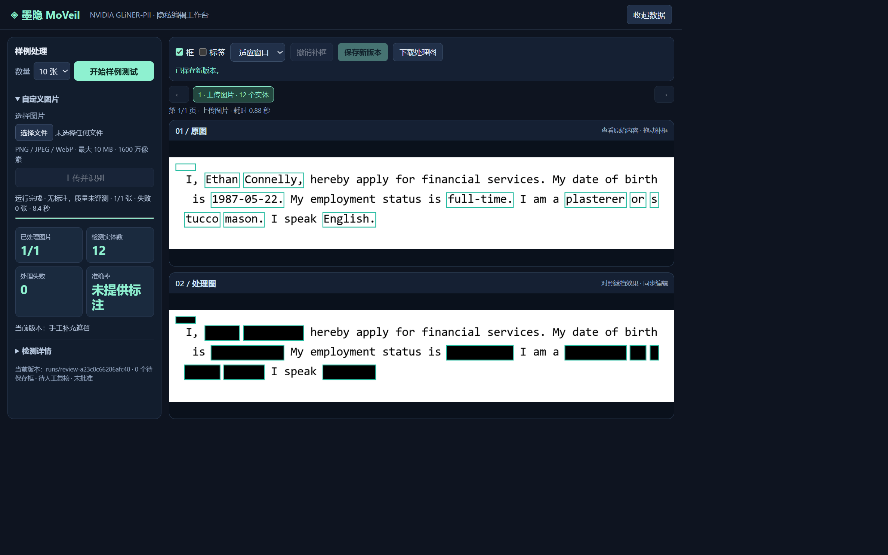

# 墨隐 MoVeil：DGX Spark 本地化图像隐私识别与辅助脱敏

## 1. 项目目标

MoVeil 面向文档截图中的个人敏感信息，构建从文字识别、语义判断到像素遮挡、人工复核与结果导出的本地工作流。DGX Spark GPU 配置采用 **PP-OCRv6 Medium + NVIDIA GLiNER-PII**，在 GB10 上完成文字识别和语义判断，将实体结果映射到图像坐标，生成可复核、可追加遮挡、可追溯的处理版本。OCR 词图批处理和跨任务常驻模型，将十图热态任务中位耗时降至 **2.62 秒**。

项目定位为图像隐私辅助脱敏工具，最终发布由业务人员结合使用场景和授权范围确认。

## 2. 应用场景

- 工单与问题反馈：处理截图中的姓名、联系方式、账号和地址，再交付协作人员。
- 文档展示与培训：对静态图片中的敏感字段进行遮挡，保留版面与业务上下文。
- 数据协作与资料分享：在本地完成识别和复核，按用途导出处理后的图片。
- 隐私处理流程演示：使用随仓公开合成样例展示 GPU 识别、像素覆盖和人工修订流程。

## 3. 功能与交互

1. 选择 1–10 张合成样例，触发实时 GPU 推理，逐张查看处理进度与结果。
2. 上传 PNG、JPEG、WebP 单帧图片；容量上限为 **10 MiB**，边长上限为 **8192 像素**，总像素上限为 **16,000,000**。
3. 单屏工作台集中展示任务、指标与编辑工具，原图和处理图上下对照；支持分页、检测框与标签切换，以及适应窗口、铺满宽度、原始尺寸三种显示模式。
4. 拖动矩形补充遮挡，实时预览并撤销草稿操作；切换页面时保留各图草稿。
5. 保存补遮挡新版本，保留已有黑色遮挡及父版本审计关系，支持连续修订。
6. 下载清除元数据的 **RGB PNG**，将复核后的像素遮挡结果用于后续协作。

### 界面展示



图 1：DGX Spark 实际运行界面，采用随仓公开合成样例 `inputs/sample.png`，展示识别与人工补框保存后的状态，截图分辨率为 **2376 × 1485**。左侧集中展示任务进度和识别数据，右侧上下排列原图与处理图，编辑工具持续可见；数据面板支持收起，实体明细按需展开，放大图片时在画布视口内滚动。带真值样例展示像素覆盖指标，上传模式展示识别结果与复核状态。

## 4. 技术架构

处理链路：**图片校验与规范化 → 原分辨率词框 → GPU 批量 OCR → GPU PII 识别 → 字符与像素对齐 → 黑色像素遮挡 → 人工复核 → 版本化导出**。

- 输入层：校验格式、尺寸和帧数，处理 EXIF 方向，转换为 RGB 图像。
- OCR 层：通过原图墨迹投影形成词框，批量送入 PaddleOCR 系列识别模型；采用 RapidAI 发布的 PyTorch 转换权重，经 RapidOCR 3.9.2 在 CUDA 上执行。几何坐标始终保持原图分辨率。
- 语义层：GLiNER-PII 在 GPU 上完成实体识别，支持 FP32、FP16 和 BF16 推理配置；当前 GPU 配置采用 FP16 autocast，模型参数保持 FP32。
- 生命周期层：OCR 实例与 NER worker 跨串行任务复用，首次任务加载，后续任务直接推理；失败任务释放模型，下次任务重新初始化，服务关闭时回收 worker。
- 通信层：通过本地 JSONL 子进程协议传递请求与响应，校验实际设备、请求序号与配置指纹，并记录异常状态。
- 遮挡层：校验实体跨度、标签和置信度，结合几何对齐将字符范围投射到图像，绘制实心黑色像素。
- 交互层：回环 HTTP 服务配合原生 HTML/CSS/JavaScript 画布，实现串行任务、结果浏览和人工补框。
- 审计层：记录运行配置、设备、软件版本及模型、源码、输入输出的 SHA256；人工修订保存父审计哈希和像素核验结果。

## 5. 模型与运行参数

### GPU OCR

- 主配置：`MOVEIL_OCR_BACKEND=ppocrv6-torch`，**PP-OCRv6 Medium**，权重 `PP-OCRv6_rec_medium.pth`，约 77.0 MB。
- 可选配置：`MOVEIL_OCR_BACKEND=ppocrv5-torch`，**PP-OCRv5 Server**，权重 `ch_PP-OCRv5_rec_server.pth`，约 134.6 MB；两种模型均已在 GB10 完成实际识别。
- 引擎：RapidOCR **3.9.2 / PyTorch CUDA**；模型资产固定为 RapidAI/RapidOCR **v3.9.2**，权重和字符字典的 SHA256 固定于 `ocr_backend.py`，加载前核验。
- 识别精度：FP32；词图 batch size **16**，通过 `MOVEIL_OCR_BATCH_SIZE` 设置，范围 1–64。每张图片最多 512 个投影词图。
- 运行范围：清洁、水平排版、深字浅底的文档图像。当前流水线复用词投影几何，复杂版面、旋转文本和自然场景属于后续评估范围。

### NVIDIA GLiNER-PII

- 模型：`nvidia/gliner-PII`。
- 固定 revision：`bd23e8ef4425fd04e34c5204ab49ffaa706eae79`。
- 权重 SHA256：`a4dfd0dcbd718acc86dca65fa99f1097d2796c8d7a681e1bc42f40f946c03802`。
- 文本窗口：**72 词**；相邻窗口重叠 **18 词**；子词预算 **352**。
- 标签分组：每组最多 **24 个标签**；置信度阈值 **0.3**；推理 batch size **1**。
- 精度：`MOVEIL_NER_PRECISION=fp16` 使用 CUDA autocast；可切换 `fp32` 或 `bf16`，BF16 启动时检查设备能力。实际参数 dtype、推理精度和设备写入审计。
- 加载方式：由 `MOVEIL_MODEL_DIR` 指定完整模型目录，包含权重、tokenizer、配置和 SentencePiece 资源，推理采用本地离线加载。

## 6. 部署与启动

**GPU 部署配置**：复用 `moveil-gliner` 容器及已有 CUDA 13 PyTorch。候选部署位于容器 `/opt/moveil-gpu-candidate`，宿主机备份位于 `/home/Developer/moveil-gpu-candidate`，服务端口为 **18201**。基线部署 `/opt/moveil-core` 与 **18200** 保留为对照和回退入口。

应用解释器 `/opt/moveil-ocr-env/bin/python` 负责图像处理与 GPU OCR，NER 解释器 `/usr/bin/python3` 负责 GLiNER。首次准备时，在已有支持 GB10 的 CUDA PyTorch 环境上创建复用系统包的独立应用环境：

```bash
/usr/bin/python3 -m venv --system-site-packages /opt/moveil-ocr-env
export MOVEIL_DEVICE=cuda
export MOVEIL_NER_PYTHON=/usr/bin/python3
export MOVEIL_APP_PYTHON=/opt/moveil-ocr-env/bin/python
export MOVEIL_MODEL_DIR=/models/nvidia-gliner-pii
export MOVEIL_OCR_BACKEND=ppocrv6-torch
export MOVEIL_OCR_MODEL_DIR=/opt/moveil-ocr-models
export MOVEIL_OCR_BATCH_SIZE=16
export MOVEIL_NER_PRECISION=fp16
export MOVEIL_LOAD_DOTENV=0
bash start.sh setup
bash start.sh prepare
bash start.sh prepare --ocr ppocrv6-torch
bash start.sh check
```

`setup` 保留 NER 环境已有的 CUDA Torch 版本，分别安装 NER、应用和所选 GPU OCR 依赖。`prepare` 获取固定资产，已有 OCR 文件先检查 SHA256。已有完整环境日常直接进入 `serve`；切换 PP-OCRv5 时先执行 `prepare --ocr ppocrv5-torch`，再设置对应 backend 并重启服务。

在 Spark 宿主机中使用已有容器启动 GPU 工作台：

```bash
docker exec -it -w /opt/moveil-gpu-candidate \
  -e MOVEIL_DEVICE=cuda \
  -e MOVEIL_NER_PYTHON=/usr/bin/python3 \
  -e MOVEIL_APP_PYTHON=/opt/moveil-ocr-env/bin/python \
  -e MOVEIL_MODEL_DIR=/models/nvidia-gliner-pii \
  -e MOVEIL_OCR_BACKEND=ppocrv6-torch \
  -e MOVEIL_OCR_MODEL_DIR=/opt/moveil-ocr-models \
  -e MOVEIL_OCR_BATCH_SIZE=16 \
  -e MOVEIL_NER_PRECISION=fp16 \
  -e MOVEIL_LOAD_DOTENV=0 \
  moveil-gliner bash start.sh serve --port 18201
```

该入口先核验环境并以独立进程处理根样例，再启动页面；页面首次任务初始化常驻模型，后续任务复用。`MOVEIL_LOAD_DOTENV=0` 采用显式变量；启动脚本清空 `PYTHONPATH`，设置 `PYTHONNOUSERSITE=1` 和 `CUBLAS_WORKSPACE_CONFIG=:4096:8`。

本机通过 `ssh -N -L 18201:127.0.0.1:18201 spark-95` 建立 SSH 转发，再访问 **http://127.0.0.1:18201**。

**配置与回退**：代码默认值为 `rapid-cpu + fp32`，`.env.example` 提供 GPU 配置；现有 `.env` 可继续保留。回退时显式设置 `MOVEIL_OCR_BACKEND=rapid-cpu`、`MOVEIL_NER_PRECISION=fp32` 后重启，或访问保留的 18200 基线服务。GPU OCR 使用 PaddleOCR 模型的 Torch 转换版，运行时由 PyTorch CUDA 执行。

**环境持久化**：OCR 环境和运行资产位于现有容器；两套 OCR 权重与字典已备份至宿主 `/home/Developer/moveil-models/ppocr-v3.9.2`，逐文件 SHA256 与固定值一致。容器重建时复建应用环境，将备份挂载或复制至 `MOVEIL_OCR_MODEL_DIR`；GLiNER 资产继续使用已有模型目录。

**基线镜像入口**：`spark.sh` 适用于 CPU OCR + GPU NER 基线。通过 `MOVEIL_IMAGE` 指定具备完整依赖的 ARM64 CUDA PyTorch 镜像，`MOVEIL_HOST_MODEL_DIR` 指定宿主机 GLiNER 目录，执行 `bash spark.sh serve --port 18200`。GPU OCR 路线使用上面的显式 `docker exec` 配置。

## 7. 开发集结果与指标

### 质量结果

GPU 配置 **PP-OCRv6 Medium FP32 + GLiNER FP16 autocast** 在固定公开合成开发集上连续运行四轮，每轮 **10 图、54 个标注实体、失败记录 0**，四轮质量一致：

- 实体完整遮挡：**51/54 = 94.44%**。
- 正确标签完整遮挡：**49/54 = 90.74%**。
- 零漏实体图片：**7/10**。
- 最大单图非敏感墨迹误遮比例：**11.2575%**。

原 CPU OCR + GLiNER FP32 基线为 **52/54 完整遮挡、44/54 正确标签完整遮挡、8/10 零漏图片**。GPU 配置正确标签完整遮挡增加 5 个实体，完整遮挡减少 1 个实体；两配置均达到既定质量门槛。新 OCR 将开发集两处 `0liver` 修正为 `Oliver`，变化后的文本上下文伴随一处额外 email 漏遮，保留原始识别结果和人工复核流程。整体召回与标签质量作为两个独立维度持续跟踪。

对应实测环境为 **NVIDIA GB10 / Linux aarch64**，驱动 **580.82.09**，Python **3.12.13**，PyTorch **2.11.0+cu130**，CUDA **13.0**，GLiNER **0.2.29**，Transformers **4.51.3**；模型执行设备为 `cuda:0`。

### 性能与生命周期

- 首次十图任务：**12.35 秒**，其中模型初始化约 **8.57 秒**。
- 同一 worker 后续三轮十图：**2.830 / 2.625 / 2.598 秒**，中位数 **2.62 秒**。
- 同一 worker 三次热态单图上传处理：**0.214 / 0.207 / 0.207 秒**，中位数 **0.207 秒**。
- 十图冷热中位耗时比约 **4.70 倍**，主要收益来自跨任务模型复用；原基线十图任务记录为 **14.1 秒**，作为历史参考。
- 空白图拒绝后释放模型，下一任务成功重新加载；关闭操作回收子进程，并拒绝继续接收任务。

计时来自 `LiveBatch`，从任务启动至推理、样例评测和结果发布完成，包含冷态模型初始化、OCR、NER 与像素输出；网络传输、上传规范化和浏览器轮询等待另计。该结果对应短文本小图、串行交互工作负载；吞吐与延迟改善已实测，GPU 饱和度和硬件极限仍需专门的大规模负载实验。

新后端页面已验证十图处理、分页、双图拖框、跨页草稿、撤销、保存、下载和上传。保存版本保留 GPU OCR/NER 信息，下载 PNG 与页面处理图 SHA256 一致，补框区域为纯黑；上传合成根样例检测到 12 个实体。

核心交付包含 **15 个顶层 Python 运行模块**。配置、OCR 元数据、模型加载时间、复用状态和 worker PID 随任务写入审计与 `performance.json`；正式四轮证据位于候选目录 `runs/gpu-validation.json`，代表性热态结果为 `runs/live-09f3e248f04322c5/`。随仓精简记录见 `docs/gpu-validation.json`，完整产物保存在 Spark 部署目录。

### 指标定义与门槛

指标基于输出图像的实际像素计算。原图任一 RGB 通道小于 250 的像素计为墨迹，真值框内的墨迹计为敏感墨迹。实体完整遮挡要求该实体全部敏感墨迹落入遮挡区域且输出像素为纯黑；正确标签完整遮挡进一步要求相同标签的遮挡框覆盖这些像素。两项比例均以标注实体总数为分母。

非敏感墨迹误遮比例为真值敏感区域之外、落入遮挡区域的墨迹像素数占全部非敏感墨迹像素数的比例。零漏实体图片比例反映单图全部标注实体获得完整遮挡的情况。

`quality_gate.json` v2 要求图片数 **≥10**、失败记录 **为 0**，且实体完整遮挡率与正确标签完整遮挡率均**严格大于 80%**。统计对象为模型自动输出，人工补框作为独立复核版本留存；上述开发集记录达到该门槛。

开发集与模型训练数据同源，结果用于固定合成开发集上的工程质量分析。后续将使用独立、经授权的业务数据开展评估，覆盖中文、复杂版面及真实业务字段，并重点改进 email/url 识别与标签映射。

## 8. 核心文件

- `agent.py`、`ocr_backend.py`、`hybrid_geometry.py`：批量 OCR、固定模型资产、输入与结果校验、几何对齐及像素遮挡。
- `ner_config.py`、`ner_worker.py`、`ner_pipeline.py`：标签映射、文本分窗、识别流水线与 worker JSONL 通信。
- `nvidia_ner_config.py`、`nvidia_ner_worker.py`、`nvidia_ner_pipeline.py`：NVIDIA 模型参数、GPU 推理与流水线封装。
- `evaluate.py`、`quality_gate.json`：像素覆盖计算、逐图测量、批量汇总与质量门槛。
- `live_batch.py`、`review.py`、`web/`：样例批处理、图片上传、HTTP 服务与复核界面。
- `run_demo.py`、`launch_check.py`、`prepare_model.py`、`tools/check_gpu.py`：应用入口、启动核验、模型准备与 GPU 环境检查。
- `start.sh`、`spark.sh`、`requirements*.txt`、`.env.example`：分离解释器启动、基线容器入口、GPU OCR 依赖和配置示例。
- `inputs/`、`private/truth.json`、`cohorts/nvidia-gliner-pii-dev-015/`：根样例、像素真值与 10 图合成样例集。
- `docs/images/workspace-overview.png`：单屏编辑工作台实机截图。
- `docs/gpu-validation.json`：GPU 配置、冷热态性能、像素质量和生命周期验证摘要。

## 9. 数据治理

OCR、实体识别和像素遮挡在运行机器内完成，浏览器通过本机或 SSH 隧道访问回环服务。服务校验 Host、Origin、Sec-Fetch-Site 与写入令牌，按资源路径约束访问；导出图片清除元数据。

模型处理图片及 OCR 文本，真值数据进入独立的指标计算流程。人工复核负责确认敏感字段、补充遮挡并选择发布版本；每项产物通过 SHA256 与来源关联，修订版本通过父审计哈希连接。

部署管理应为原图、上传文件、OCR 文本、审计记录和输出版本设置访问权限，按授权用途制定保留期限、备份策略与到期清理流程，并将运行目录纳入数据生命周期管理。

## 10. 数据来源与许可

随仓图像来自 NVIDIA `nvidia/Nemotron-PII` 公开合成数据，固定 revision 为 `b70ffaf5ff39e079776134c5bf4381f00a9fd1ed`；根样例取自 train offset 50000，10 图开发集取自 50001–50010。项目将合成文本渲染为 PNG，并增加字符与像素真值；来源、记录标识及哈希见 `SOURCE.json`、`SOURCE-MANIFEST.json` 和 `cohorts/nvidia-gliner-pii-dev-015/manifest.json`。

源码采用 **Apache-2.0**，许可及归属声明见 `LICENSE`、`NOTICE`；数据采用 **CC BY 4.0**；GLiNER 权重采用 **NVIDIA Open Model License**；PaddleOCR 系列权重及 RapidAI 转换资产按上游 **Apache-2.0** 条款使用，权重通过固定上游版本单独获取。数据作者为 Amy Steier、Andre Manoel、Alexa Haushalter、Maarten Van Segbroeck，来源机构为 NVIDIA。分发衍生图像时应保留署名、许可及修改说明；模型、软件依赖和容器组件分别遵循各自许可，详细归属见 `THIRD_PARTY_NOTICES.md`。
